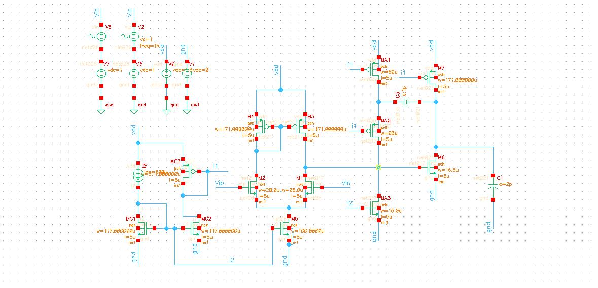

During my undergraduate studies, I encountered the concepts of Very Large Scale Integration(VLSI) and signal designing. With the improvement in computer and mobile technology, there is an increased demand for high-speed processors. In order to get a very large-scale integration you need to have thousands of devices in a small area. In my basic electronics class, I was taught that transistors are the building block of all the electronic devices, and was curious to know more about them. Because of my inquisitiveness, I enrolled in the Analog Circuits course to study the characteristics of analog devices in depth. I discovered that analog circuits form the building block to numerous applications in the field of electronics such as power conversion, frequency mixing and filtering, that were discussed during the coursework.   
                       One of the key features of EE591, was that I was compelled to imagine things at a small scale and it made me realise how drastically a situation changes while going from macro-level to micro-level. Small signal analysis and making models from that analysis were the things I liked the most about this subject. Explanation of individual topics were all conceptual rather than case specific which prepared me ready to solve any kind of complex circuitry. Dr Sanyal gave us a thorough explanation on MOSFETs, current mirrors and references, frequency responses and amplifiers. Since one of my other interests is Hardware designing, MOSFETs, their properties, and how they work is most important to me.  
		Although the art of design of analog devices is arduous and difficult to master, I have tried to inculcate all the learnings from my analog circuit course and have sought to hone those skills by working on circuit problems with Cadence. Moreover, this software gave me insight on how to go about solving a circuit’s working and execution issues in real time. For final design project, I designed a two stage amplifier, it started by creating basic MOSFET circuits followed by larger amplifier circuit that used these MOSFETs and so on. Error and performance analysis, ADE simulation was an equally important task. You can find the project report, and other details by going to projects at SUNY Buffalo section of my portfolio or <a href="https://github.com/darshiltrivedi/Analog_Circuits_Reflection" target="_blank" >Click Here</a>   
		It was a great learning experience for me which helped me develop the knowledge about circuits with an analog perspective. At the end, I would highly recommend Analog Circuits course to any of the incoming students at UB, who has interest in VLSI. Anyone with the basic knowledge of electronics can take this subject and master it. 

